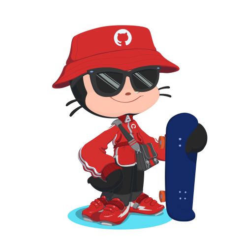

# 👋 Hola, soy Adrian Potenciano 💻
___

___

Soy [**estudiante**](https://www.iesluisvives.es/) de Formación Profesional en un grado superior en [DAM](https://www.todofp.es/que-como-y-donde-estudiar/que-estudiar/familia/loe/informatica-comunicaciones/des-aplicaciones-multiplataforma.html)

Soy un joven de 18 años, motivado y aficionado por la informatica.

Decidí empezar el curso de DAM porque desde que era un niño siempre me apasionó el mundo de la informatica.

Gracias a este curso estoy descubriendo nuevas utilidades de la tecnologia así como mejorar día a día en todo lo que aprendo para convertirme en un gran programador.

Tengo mucha ambición y me dejo llevar por la frase __"*Da siempre lo mejor que tienes.Lo que plantes ahora lo cosecharas más tarde*."__
___
## 🔥 Aplicaciones y lenguajes utilizados 🔥

___

## 📩 Contáctame 📩

    <height="50">
    </a> &nbsp;&nbsp;
     &nbsp;&nbsp;
     &nbsp;&nbsp;
     &nbsp;&nbsp;
    <a href="https://discordapp.com/users/adri 04#0630" target="_blank">
         &nbsp;&nbsp;
    </a> &nbsp;&nbsp;
     <a href="https://www.instagram.com/adri04._/" target="_blank">
         &nbsp;&nbsp;
    </a> &nbsp;&nbsp;
     &nbsp;&nbsp;
     </a> &nbsp;&nbsp;
     &nbsp;&nbsp;
    </a> &nbsp;&nbsp;
     &nbsp;&nbsp;

______

## 🎮 Proyecto en desarrollo 🎮

______
                                                            

